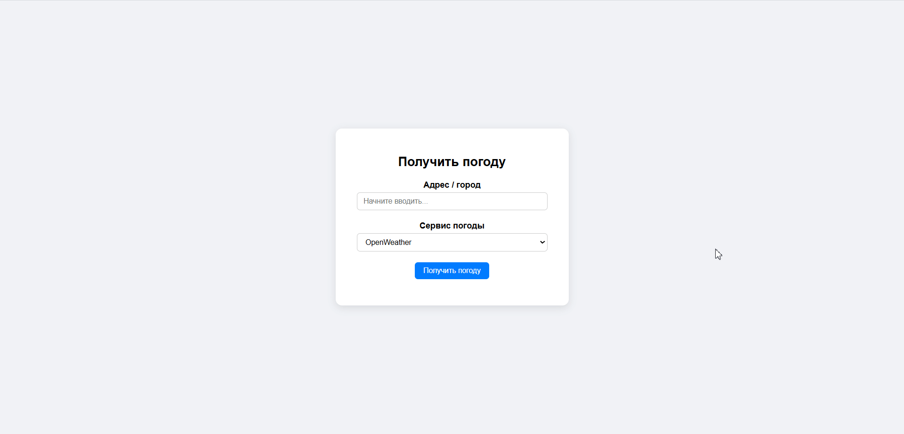

# Zephyr

Zephyr — веб-приложение, позволяющее получать текущие погодные данные для указанного места.
Пользователи могут выбирать сервис погоды по своему усмотрению.

## Пример работы



## Технологии

- Языки:
    - Asp.Net 8.0
    - Js
- Библиотеки
  - AutoMapper: для маппинга DTO погоды в внутренние модели
  - Swagger: автогенерация API-документации
  - Dadata: клиент сервиса
- Сторонние сервисы
    - Подсказки: [Dadata](https://dadata.ru/api/suggest/address/)
    - Погода:
        - [OpenWeather](https://openweathermap.org/api)
        - [Open-Meteo](https://open-meteo.com/)
        - [Яндекс.Погода](https://yandex.ru/dev/weather/)

## Установка и запуск

#### 0. Требования

- Docker
- Git

#### 1. Клонируйте и перейдите в папку репозитория

```bash
  git clone https://github.com/Balalaikajun/Zephyr.git
  cd Zephyr
```

#### 2. Создайте переменных окружения при помощи команды и введите внутрь ключи к Api

```bash
    cp .env.example .env
```

#### 3. Запустите приложение

```bash
    docker-compose up -d
```

#### 4. Доступ к приложению

- Приложение: http://localhost
- Документация Swagger: http://localhost:80/swagger

#### 5. Остановите приложение

```bash
    docker-compose down
```